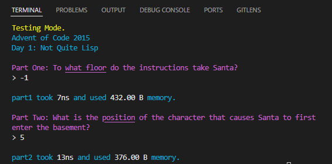

# Advent of Code

My Advent of Code solutions in PHP.

## How to Use

### Requirements

- `php >= 8.1` - only tested on php 8.1, not guaranteeing it works on lower versions, but it probably will if the type declarations are removed.
- `composer`

### Clone the repository

```bash
git clone https://github.com/mikeydevelops/advent-of-code.git
```

### Install Dependencies

```bash
composer install
```

### Logging in

After you have installed the dependencies, you have to provide session key for the application
to be able to work properly. Follow the steps bellow to get your session key.

1. Visit https://adventofcode.com
2. After the site has loaded, press `F12` or `CTRL+SHIFT+I` on your keyboard.
3. After developer tools open, click on `Application` tab,
   for chromium based browsers, or `Storage` tab for firefox.
4. Expand Cookies from the left sidebar and click on https://adventofcode.com
5. Copy the value from the cookie row with name session.
6. Paste the value in .env file setting the AOC_SESSION variable.

### Running the application

`php ./advent` or `./advent`. To see what options are available use `./advent --help`.

When you run solutions, information about the chosen day is automatically downloaded from adventofcode.com
and used when showing the result of the solutions.

### Running the solution scripts

`php ./advent solution --year <year> --day <day>` where `<year>` and `<day>` are the date you want to run the solution for. For example: `php ./advent solution --year 2015 --day 1`.

If you want to run second part of the solution, add the `--part2` or `-2` argument. For example: `php ./advent solution --year 2015 --day 1 --part2`.

If you want to run both parts at the same time, you have to add both `--part1` and `--part2` or `-1` and `-2` arguments to the command. `php ./advent solution --year 2015 --day 1 --part1 --part2`.

You can also use shorthand names: `php ./advent solution -y 2015 -d 1 -12`.

If you want to test your code, you can use the `--test` or `-t` flag. Then only the given `$exampleInput` will be used.

If you want to profile your code, you can use the `--profile` or `-p` flag. Then after each part of the solution `time taken` and `memory usage` will be shown.

Example output when running `./advent solution -y 2015 -d 1 -12pt`:


That command runs solution for year 2015, day 1, shows first and second part, enables profiling, enables test mode.

## Directories & Files

- `/storage/cache/pages` holds the cached html pages for each of the challenges.
- `/storage/cache/days` holds the cached json information files parsed from the html pages.
- `/storage/cache/inputs` holds the cached inputs for each of the challenges.
- `/storage/temp` where temporary files needed by the app are stored. Currently only used when profiling solutions to keep memory usage down.

## Todo

 - [x] automatically fetch input.
 - [ ] refactor solutions to use OOP.
 - [ ] submit solutions from cli (maybe never).
 - [x] download day description automatically.
